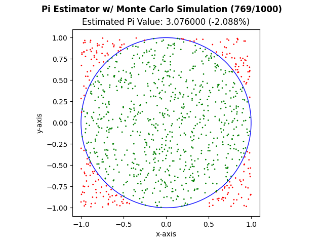
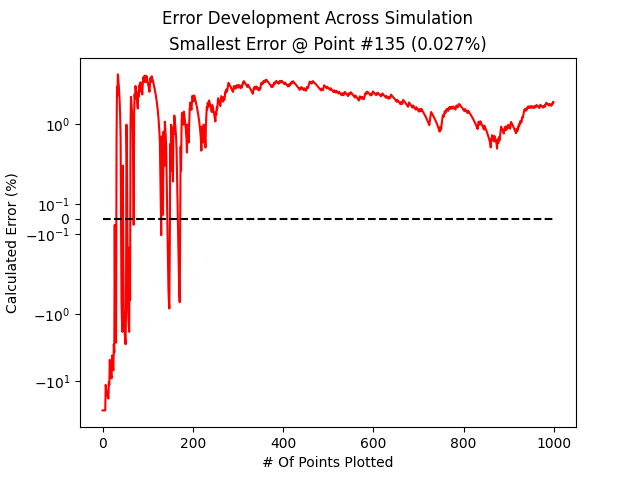

# Monte Carlo Simulations

This repository is currently being used to house the various projects and simulations while I explore how Monte Carlo Simulations work and are used in the real world! This repo will slowly expand over time and I hope to add new projects every week. The goal is to create these projects with LITTLE to NO AI usage so I truly understand how it works.

---

## Projects
 
| # | Project | Status |
|---|---------|--------|
| 1 | Pi Value Estimation & Visualization | Complete |
| 2 | Coming Soon | — |

---


## 1. Pi Estimation & Simulation

Using matplotlib and numpy, this simulation plots a circle of radius 1 and an N number of points within a 2x2 square. In order to calculate the value of Pi, the following formula is used:

```
pi ≈ (points_inside_circle / total_points) × 4
```

The simulation shows the progression of both the value of pi as the points are quickly plotted and the final error progression chart. The error on a normal linear scale between the values of [-0.5, 0.5] and a log scale outside of the range to clamp outliers while still allowing them to remain visible. 

### Example Output
 
| Visualization | Error Progression |
|:---:|:---:|
|  |  |
 

### Usage
 
```
python 1_Pi_Estimator/pi_estimation.py [FLAGS]
```
 
| Flag | Description | Default |
|------|-------------|---------|
| `-P`, `--points` | Number of simulation points | `500` |
| `-S`, `--save` | Save output plots to disk | `False` |

**Example Usage**
 
Run with 500 points, no saving:
```bash
python 1_Pi_Estimator/pi_estimation.py
```
 
Run with 1000 points and save plots:
```bash
python 1_Pi_Estimator/pi_estimation.py -P 1000 --save True
```

---